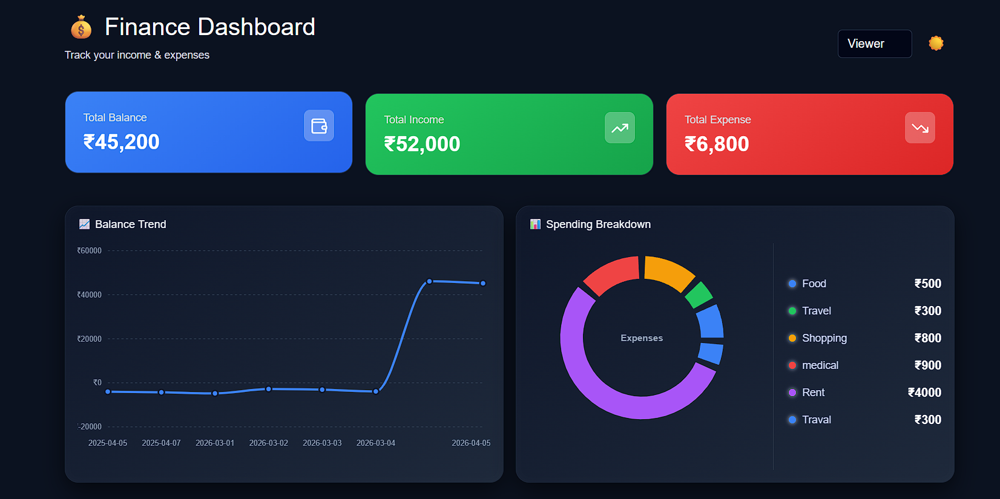
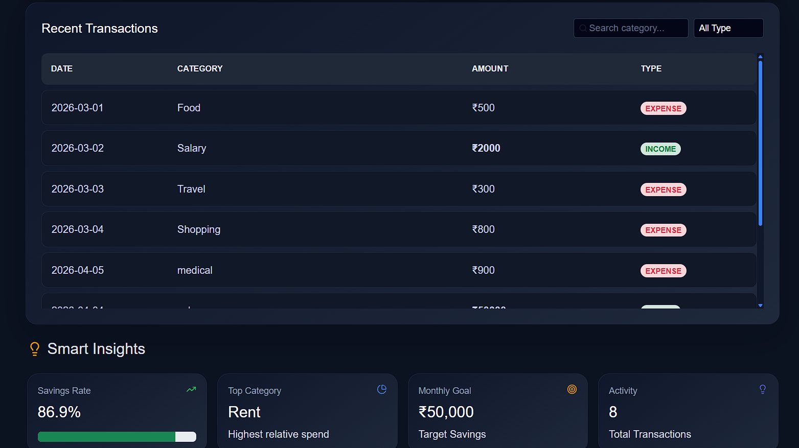
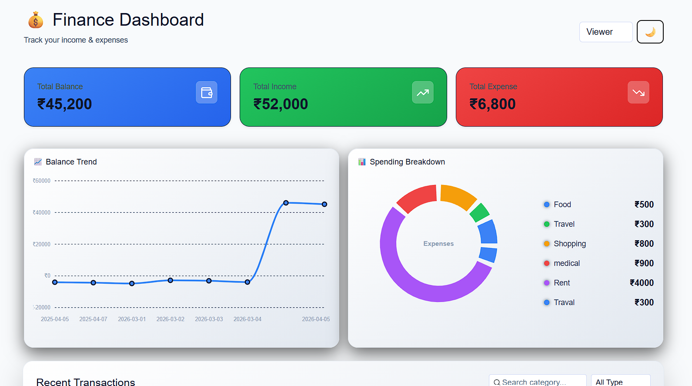

# 💰 Finance Dashboard

A modern and responsive Finance Dashboard built using React. This application helps users track income and expenses, visualize spending patterns, and gain useful financial insights.

---

## 🔍 Overview

The Finance Dashboard is designed to provide a simple yet powerful interface for managing personal finances. Users can add, edit, and delete transactions while viewing real-time updates in charts and summary cards.

The application supports role-based access (Admin/Viewer) and includes a dark/light theme for better user experience.

---

## ⚙️ Setup Instructions

Follow these steps to run the project locally:

### 1. Clone the repository

```bash
git clone <your-repository-link>
```

### 2. Navigate to the project folder

```bash
cd finance-dashboard
```

### 3. Install dependencies

```bash
npm install
```

### 4. Start the development server

```bash
npm run dev
```

## 🧠 Approach & Architecture

The project is built using a component-based architecture with React.

### State Management

- Used **Context API** to manage global state (transactions, theme, role, filters)
- Ensures clean data flow across components without prop drilling

### Data Persistence

- Transactions and theme are stored in **localStorage**
- This allows data to persist even after page refresh

### Performance Optimization

- Used `useMemo` for:
  - Calculating totals (income, expenses)
  - Preparing chart data

- Prevents unnecessary recalculations and improves performance

### UI & Responsiveness

- Built with **Bootstrap + custom CSS**
- Fully responsive layout for mobile and desktop
- Dark/Light theme implemented using `data-theme` attribute

---

## 🚀 Features

### 💸 Transaction Management

- Add new transactions (Admin only)
- Edit and delete existing transactions
- Real-time updates in UI

### 📊 Data Visualization

- **Line Chart** → Shows balance trend over time
- **Pie Chart** → Displays expense distribution by category

### 📈 Dashboard Summary

- Total Balance
- Total Income
- Total Expense

### 💡 Smart Insights

- Savings rate calculation
- Highest spending category
- Total transaction count
- Monthly goal display

### 🔐 Role-Based Access

- **Admin** → Full access (Add/Edit/Delete)
- **Viewer** → Read-only access

### 🌙 Theme Toggle

- Switch between Dark and Light mode
- Theme preference stored in localStorage

### 🔍 Filtering & Search

- Filter by income/expense
- Search transactions by category

---

## 📁 Folder Structure

```
src/
│── components/
│   ├── AddTransaction.js
│   ├── TransactionTable.js
│   ├── SummaryCard.js
│   ├── Charts.js
│
│── pages/
│   ├── Dashboard.js
│   ├── Insights.js
│
│── context/
│   ├── AppContext.js
│
│── data/
│   ├── data.js
│
│── App.js
```

---

## 💡 Key Learnings

- Implemented global state using Context API
- Built reusable components for scalability
- Integrated charts using Recharts
- Designed responsive UI with theme switching
- Managed persistent state using localStorage

---

## 🔮 Future Improvements

- Backend integration (FastAPI / Node.js)
- Authentication using JWT
- Database (MongoDB / PostgreSQL)
- Export reports (PDF/Excel)
- Advanced analytics

---

## 👤 Author

Samarth Sable

---




